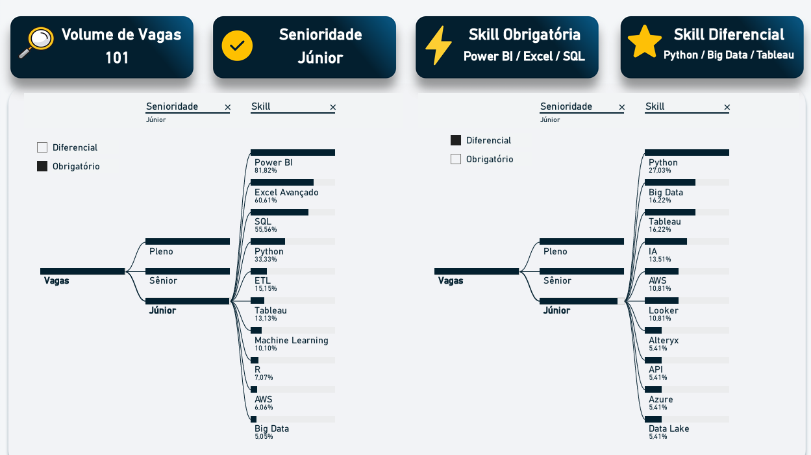
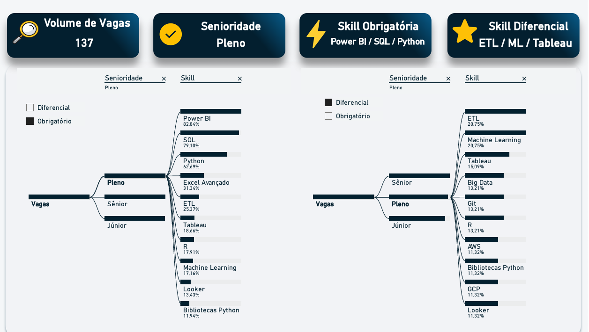
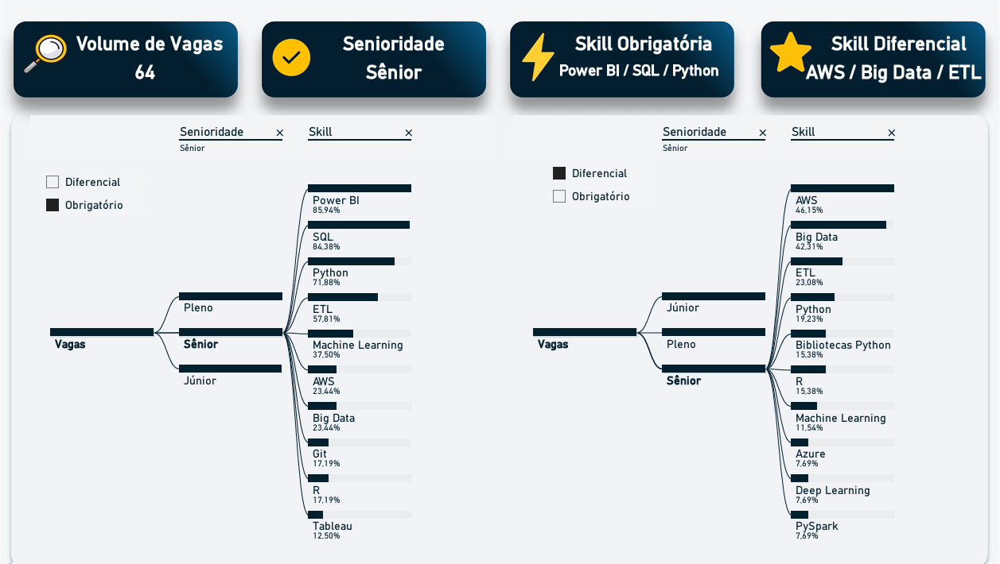

# Análise do Mercado de Dados — Evolução por Senioridade

> 📌 **Projeto de Análise do Mercado de Dados Brasileiro**  
> Baseado em vagas reais, utilizando IA para classificar competências técnicas por senioridade e nível de exigência (**Obrigatório** vs **Diferencial**).

---

## 1. Metodologia

O projeto mapeou o mercado de dados brasileiro por meio da extração de informações de vagas reais.  
As descrições textuais foram processadas com apoio de IA para converter requisitos técnicos em métricas estruturadas, classificadas como:

- **Obrigatório**
- **Diferencial**

Essa abordagem permite identificar padrões de exigência técnica ao longo da progressão de carreira.

---

## 2. Evolução por Senioridade

###  Júnior (101 Vagas)

**Visão Geral:**  
O nível Júnior é dominado por ferramentas de BI e análise básica. Diferenciais técnicos ainda não são amplamente exigidos, mas já criam vantagem competitiva.

**Principais Insights**
- **Obrigatório:** Power BI (81,82%), Excel Avançado (60,61%) e SQL (55,56%).
- **Diferencial:** Python (27,03%), Tableau e Big Data (16,22%).
- **Insight:** No nível Júnior, o domínio de ferramentas de visualização e planilhas ainda é o maior filtro de entrada.

  

---

###  Pleno (137 Vagas)

**Visão Geral:**  
No nível Pleno ocorre a transição crítica de BI para engenharia analítica. Python deixa de ser diferencial e passa a ser um pilar técnico.

**Principais Insights**
- **Obrigatório:** Power BI (82,84%), SQL (79,10%) e Python (62,69%).
- **Diferencial estratégico:** ETL (20,75%), Machine Learning (20,75%) e Tableau (15,09%).
- **Mudança estrutural:** A senioridade Pleno exige que o profissional saia da visualização e entre na manipulação e transformação de dados.

  

---

###  Sênior (64 Vagas)

**Visão Geral:**  
O foco no nível Sênior migra da análise para arquitetura, escala e governança de dados.

**Principais Insights**
- **Obrigatório:** Power BI (85,94%), SQL (84,38%) e Python (71,88%).
- **Diferencial dominante:** AWS (46,15%), Big Data (42,31%) e ETL (23,08%).
- **Leitura técnica:** Senioridade está associada à capacidade de orquestrar pipelines e ambientes complexos

  

---

## 3. O Peso Estratégico do Tableau

Embora o **Power BI** concentre o maior volume de exigências ao longo da carreira, o **Tableau** surge como o principal diferencial competitivo.

Seu pico ocorre no nível Pleno, onde:
- é o **3º maior diferencial técnico (7,21%)**
- atinge **10,73% de obrigatoriedade técnica** quando ferramentas básicas são desconsideradas

Isso indica que o Tableau funciona como um **marcador de especialização**, especialmente fora do ecossistema Microsoft.

---

## 4. Recomendações de Carreira (Pathing)

1. **Início (Júnior):**  
   Priorize Power BI e SQL. Estude Bibliotecas Python e Tableau para criar diferenciais competitivos.

2. **Meio (Pleno):**  
   Domine Python (Pandas, NumPy), ETL e consolide SQL. Use Tableau para visualizações mais complexas.

3. **Fim (Sênior):**  
   Direcione o aprendizado para arquitetura em nuvem (AWS/Azure), Big Data e orquestração de pipelines (ex.: Apache Airflow).

---

## 5. Conclusão

A análise demonstra uma progressão clara do mercado:  
o profissional evolui de um perfil focado em **consumo de dados** (Júnior/BI) para um perfil de **construção e governança de arquitetura** (Sênior/ETL/Cloud).

O Tableau atua como uma ponte estratégica nesse caminho, oferecendo um diferencial competitivo sólido para quem busca posições de maior senioridade e especialização técnica.

-------------------------------------
# Job Market Analysis 

## 🖥️ Descrição do Projeto
- Este projeto tem como objetivo analisar **vagas reais de emprego na área de dados**, coletadas a partir de plataformas de recrutamento (ex: LinkedIn), para extrair insights sobre **skills demandadas, tendências do mercado e gaps de competências**.

- A análise é inicialmente focada no **mercado brasileiro**, com posterior **comparação com dados internacionais**, visando identificar padrões globais e possíveis tendências que podem chegar ao Brasil no futuro.

- O projeto transforma dados não estruturados em **insights analíticos e dashboards interativos**, documentando todo o pipeline de dados de forma clara e profissional.

---

## 🔹 Coleta de Dados
> **Desafio:** LinkedIn possui API fechada, impossibilitando a coleta automatizada de vagas diretamente via Python.

> **Solução:** Para contornar, coletei os dados manualmente, visitando cada vaga e usando prompts de IA para extrair informações estruturadas (empresa, cargo, localização, data e skills).

Essa abordagem garantiu **eficiência e confiabilidade** para o pipeline subsequente.

---

## 🛠️ Tecnologias e Ferramentas

O fluxo do projeto segue:

**Coleta**  ⟶ **Visualização**  ⟶ **Limpeza**  ⟶ **Análise**  ⟶ **Apresentação**  ⟶ **Documentação** 

| Etapa | Ferramenta | Função |
|-------|------------|------|
| Coleta & extração | IA via prompts | Extrai dados estruturados da vaga |
| Visualização inicial | Excel | Conferência e revisão rápida. Arquivo: **[Raw Data](https://raw.githubusercontent.com/gyamada22/Job-Market-Analysis/main/data/Vagas_Coletadas_Raw.xlsx)** |
| Limpeza e padronização | Python | Padroniza dados, corrige inconsistências e gera Excel/SQL. Arquivo: **[Cleaned Data](https://raw.githubusercontent.com/gyamada22/Job-Market-Analysis/main/data/Vagas_Coletadas_Cleaned.xlsx)**, Script: **[ETL.py](https://github.com/gyamada22/Job-Market-Analysis/blob/main/data/ETL.py)** |
| Modelagem e análise | SQL | Criação de tabelas, views e queries analíticas *(em desenvolvimento)* |
| Dashboards | Power BI | Visualização interativa, insights e storytelling |
| Documentação | GitHub | Registro completo do projeto, metodologia e exemplos de dashboards |

> 💡 Observação: Python permite **automatizar toda a cadeia de transformação**, tornando o fluxo de dados mais eficiente e escalável do que usar Excel para limpeza manual.

---

## 🎯 Objetivos
- Coletar dados de vagas reais: empresa, cargo, localização, data, nível de senioridade e requisitos técnicos.  
- Padronizar e estruturar dados textuais não estruturados (descrições de vagas).  
- Identificar **skills mais demandadas** por área e nível (estágio, júnior, pleno, sênior).  
- Analisar **diferenças e gaps de competências** entre níveis de senioridade.  
- Comparar o mercado brasileiro com dados internacionais para identificar **tendências emergentes**.  
- Criar dashboards interativos que apoiem **decisões de carreira e estudo**.  
- Documentar todo o pipeline: **coleta → limpeza → análise → visualização**.

---

## ✅ Status Atual
- [x] Estrutura de pastas criada  
- [x] Coleta de dados inicial 
- [ ] Modelagem do banco de dados  
- [ ] Primeiras análises  
- [ ] Dashboard inicial  

---

## 🔹 Observações Finais
- Pipeline eficiente, contornando limitações do LinkedIn  
- Uso integrado de IA, Python, SQL, Power BI e Excel
- Documentação clara, garantindo transparência e profissionalismo para portfólio
